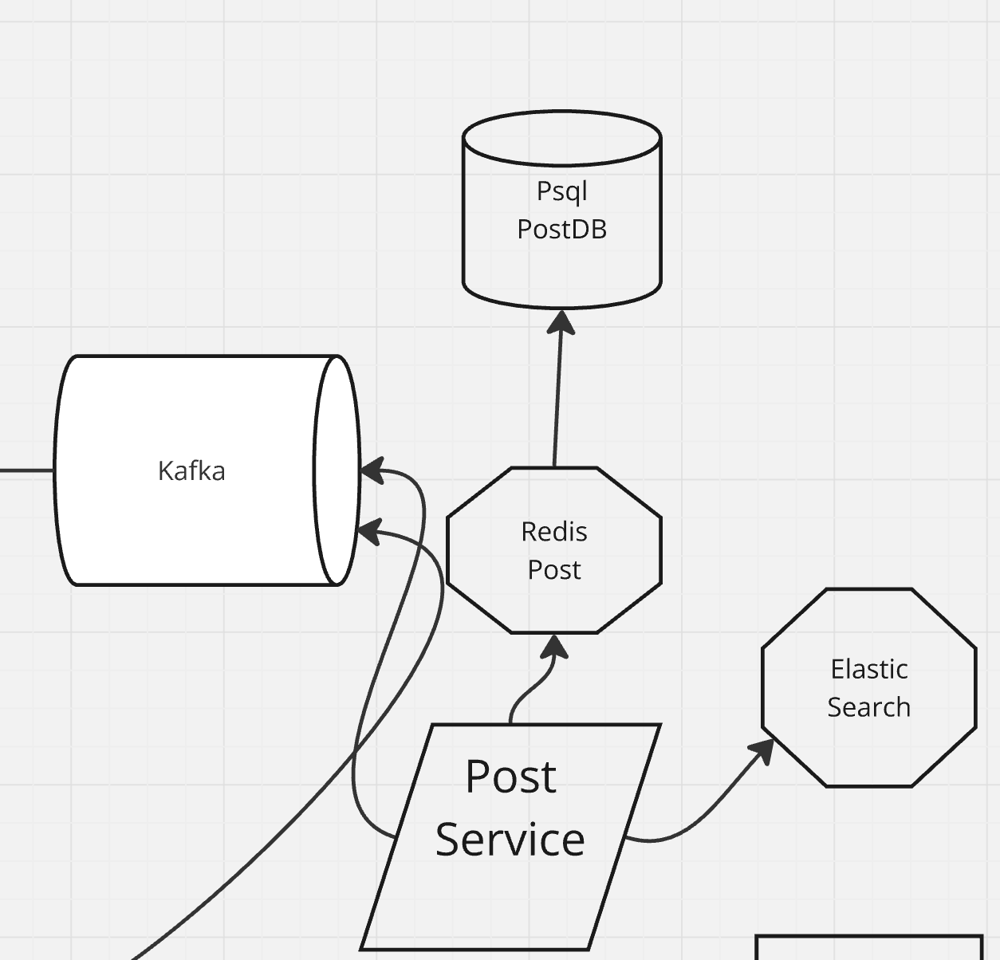
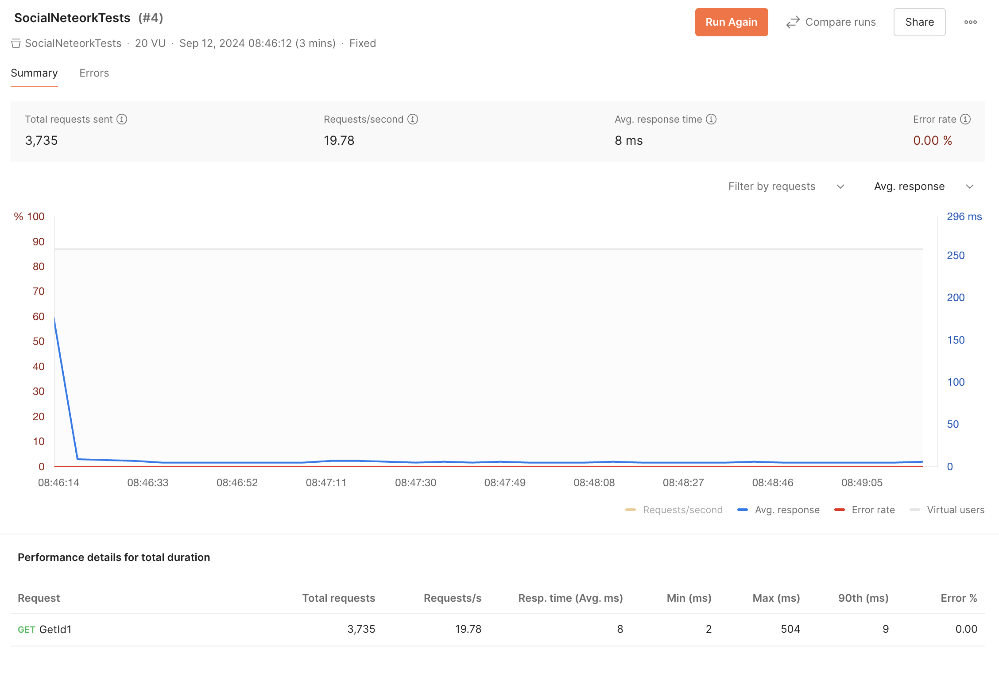

# Сервис Постов

## Содержание

- [Введение](#введение)
- [Используемые Технологии](#используемые-технологии)
- [Функциональные Возможности](#функциональные-возможности)
- [Архитектура](#архитектура)
- [API Эндпоинты](#api-ендпоинты)
- [Кэширование с Redis](#кэширование-с-redis)
- [Сравнительная Производительность](#сравнительная-производительность)

## Введение

**Сервис Постов** — это надежный и масштабируемый сервис, предназначенное для управления пользовательскими постами в проекте социальной сети. Этот учебный проект демонстрирует интеграцию различных современных технологий для обеспечения эффективной обработки данных. 

## Используемые Технологии

- **Java 21**
- **Spring Boot 3.1.4**
- **PostgreSQL**
- **Redis**
- **Elasticsearch**
- **Kafka**
- **JUnit 5**
- **Mockito**
- **Maven**

## Функциональные Возможности

- **Создание, Чтение, Обновление, Удаление (CRUD)** операций для пользовательских постов.
- **Кэширование** постов с использованием **Redis** для повышения производительности.
- **Полнотекстовый поиск** с помощью **Elasticsearch**.
- **Сбор активности пользователя** через **Kafka** (сама обработка находится в другом сервисе).
- **Хранение данных** с использованием **PostgreSQL**.
- **Модульное и Интеграционное Тестирование** для обеспечения надежности кода.

## Архитектура

Сервис Постов следует **микросервисной** архитектуре, акцентируя разделение ответственности и масштабируемость. Основные компоненты включают:

1. **Слой Контроллеров**: Обработка HTTP-запросов и ответов.
2. **Слой Сервисов**: Содержит бизнес-логику и взаимодействует с репозиториями.
3. **Слой Репозиториев**: Управление доступом к данным с использованием JPA для PostgreSQL и репозиториев Elasticsearch.
4. **Слой Сообщений**: Использование Kafka для коммуникации в реальном времени.
5. **Слой Кэширования**: Реализация Redis для кэширования часто запрашиваемых данных.

## API Эндпоинты

### Получение Поста по ID
- **URL**: `/posts/get`
- **Метод**: `GET`
- **Параметры**:
   - `id` (Long) — ID поста.
- **Ответы**:
   - `200 OK` с объектом `PostDTO` в теле.
   - `404 NOT FOUND` если пост не найден.

### Создание Поста
- **URL**: `/posts/create`
- **Метод**: `POST`
- **Тело**: `PostDTO`
- **Ответы**:
   - `200 OK` с подтверждением.
   - `400 BAD REQUEST` при ошибке валидации.

### Поиск Постов
- **URL**: `/posts/search`
- **Метод**: `GET`
- **Параметры**:
   - `pattern` (String) — поисковый запрос.
   - `page` (int) — номер страницы.
   - `size` (int) — размер страницы.
- **Ответы**:
   - `200 OK` с результатами поиска.

### Обновление Поста
- **URL**: `/posts/update`
- **Метод**: `PUT`
- **Тело**: `PostDTO`
- **Ответы**:
   - `200 OK` с подтверждением.
   - `404 NOT FOUND` если пост не найден.

### Удаление Поста
- **URL**: `/posts/delete`
- **Метод**: `DELETE`
- **Параметры**:
   - `id` (Long) — ID поста.
- **Ответы**:
   - `200 OK` с подтверждением.
   - `404 NOT FOUND` если пост не найден.

## Кэширование с Redis

Для ускорения работы сервиса используется **Redis**. Основные принципы:

1. **Чтение из Кэша**: Если пост запрашивается, сначала проверяется наличие в Redis.
2. **Кэширование При Чтении**: Если поста нет в кэше, он извлекается из базы данных и сохраняется в Redis на 10 минут.
3. **Обновление Кэша**: При обновлении или удалении поста, кэш соответствующего объекта сбрасывается.

## Сравнительная Производительность

### Без Redis
- **Время отклика**: Зависит от времени обработки запроса в базе данных.
- **Нагрузка на базу**: Высокая при большом количестве запросов.

### С Redis
- **Время отклика**: Снижено благодаря обслуживанию из памяти.
- **Нагрузка на базу**: Уменьшена благодаря кэшированию.

#### Сравнительная Таблица

| Метрика                 | Без Redis | С Redis |
|-------------------------|-----------|---------|
| Среднее время отклика   | 34 мс     | 8 мс    |
| Нагрузка на БД          | Выше      | Ниже    |

#### Графики

*Время отклика сервиса без кэширования.*

*Время отклика сервиса с Redis.*